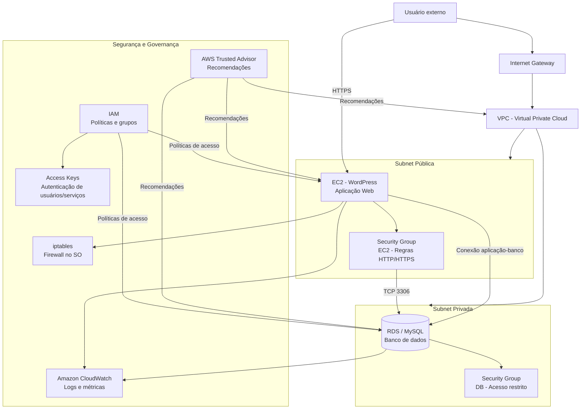

# Migração On-Premise para AWS (TCC)

Projeto de TCC voltado para a migração de uma infraestrutura on-premise para a AWS, com foco em WordPress, MySQL, monitoramento e segurança de infraestrutura.

## Objetivo

Avaliar e implementar uma migração de ambiente web para a nuvem, preservando disponibilidade, controle de acesso e observabilidade da aplicação.

## Serviços e ferramentas

| Serviço / Ferramenta | Função |
|---|---|
| WordPress | Aplicação web hospedada em instância EC2 |
| MySQL | Banco de dados relacional da aplicação |
| Amazon CloudWatch | Monitoramento de métricas e logs da infraestrutura |
| AWS Trusted Advisor | Recomendações de custo, segurança e performance |
| Iptables | Firewall configurado na camada do sistema operacional Linux |

## Status
✅ Concluído

## Diagrama de topologia de rede AWS

## Descrição da arquitetura

- A aplicação WordPress roda em uma instância EC2 localizada na subnet pública.
- O banco de dados MySQL fica em uma subnet privada, isolado de acesso direto externo.
- O Security Group da instância EC2 permite tráfego Web, enquanto o Security Group do banco restringe o acesso apenas à aplicação.
- O iptables atua como camada adicional de firewall no sistema operacional.
- Amazon CloudWatch e AWS Trusted Advisor complementam o monitoramento e a governança da solução.
